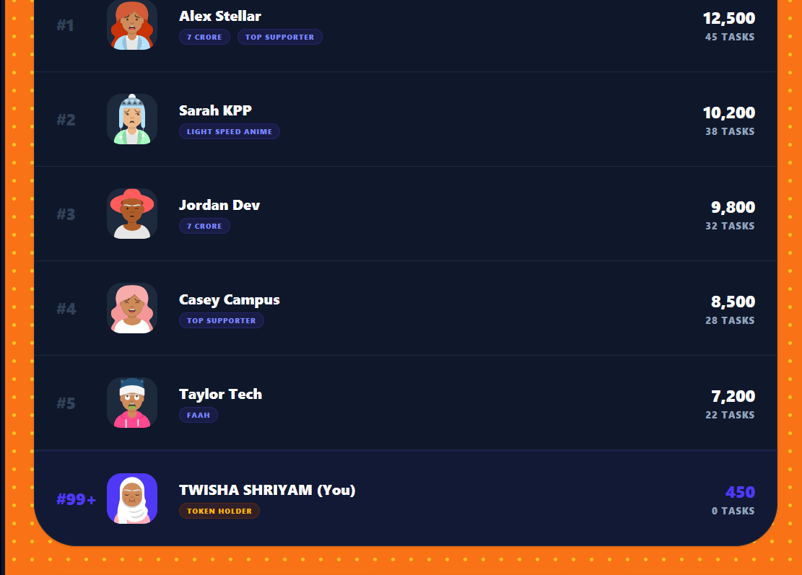
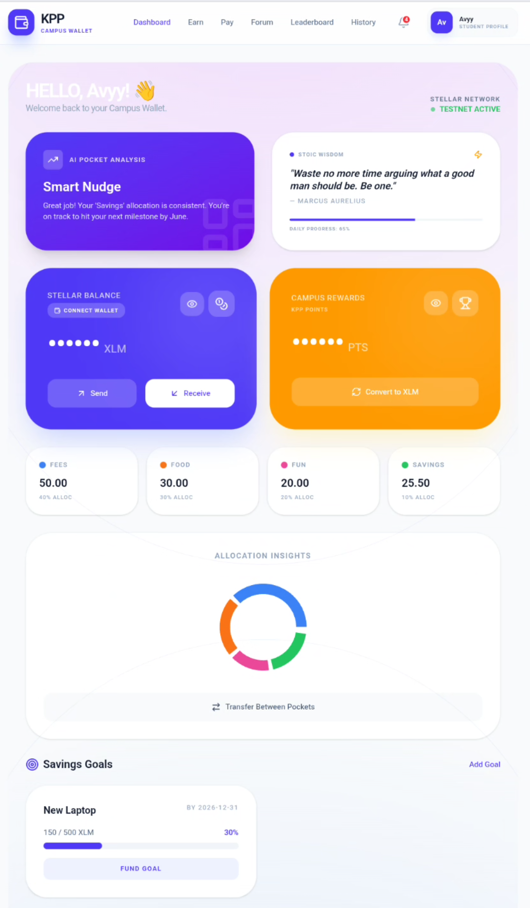
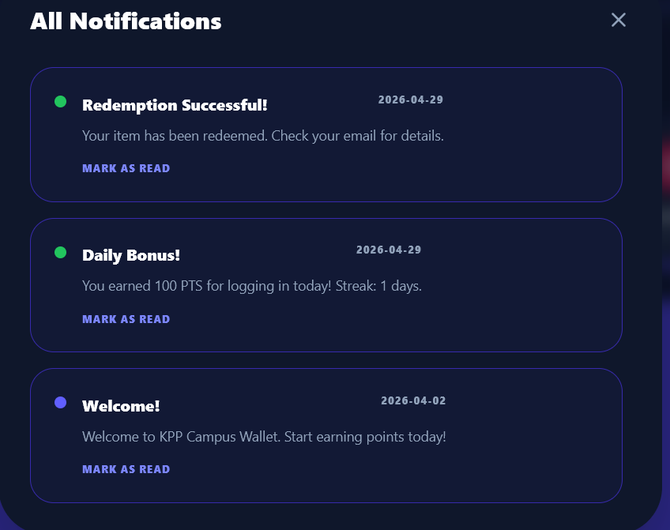
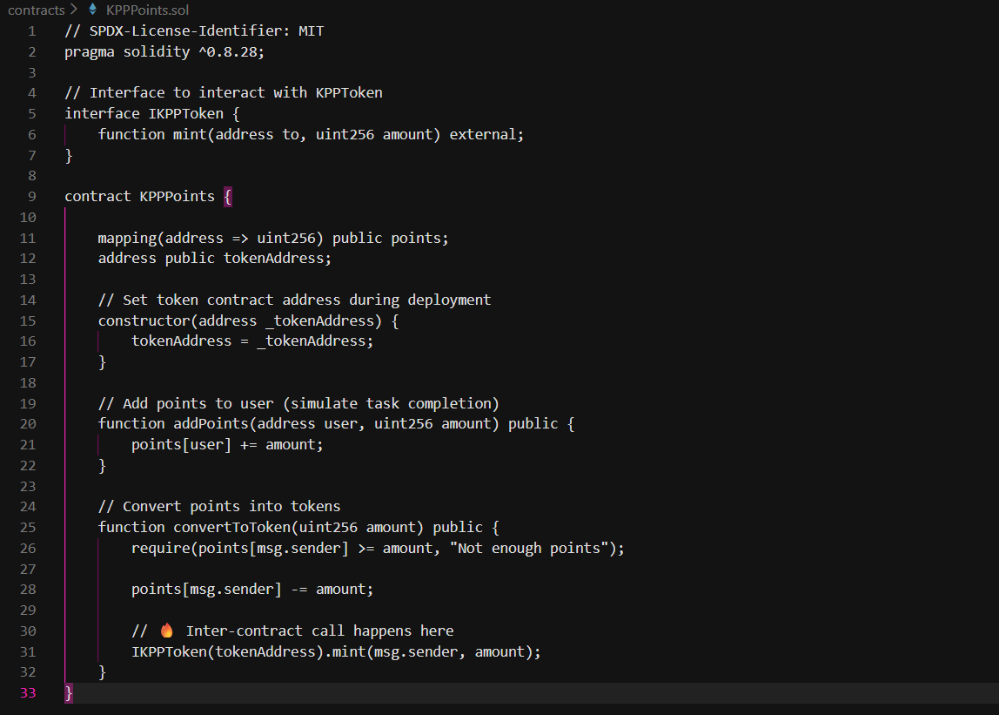
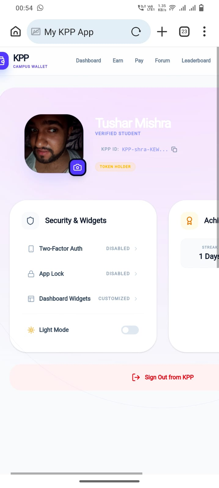
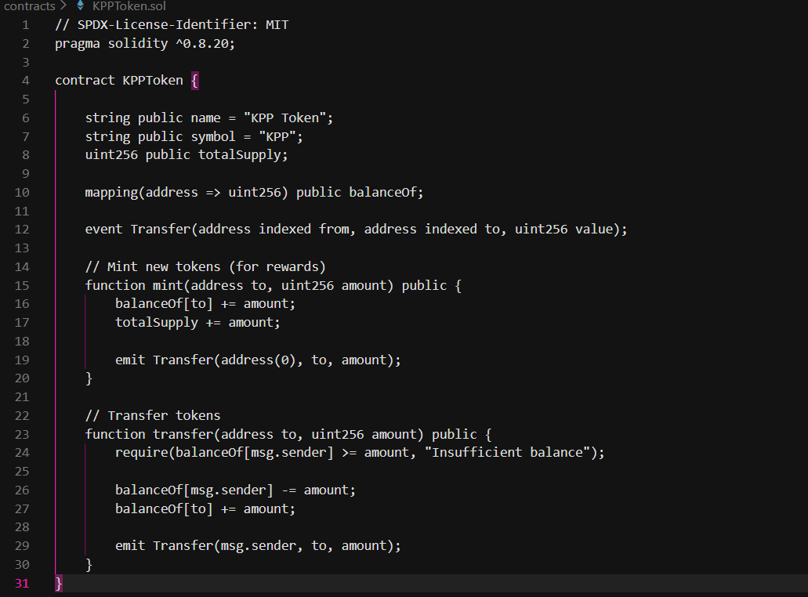
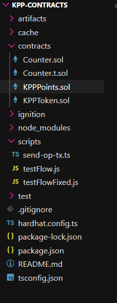
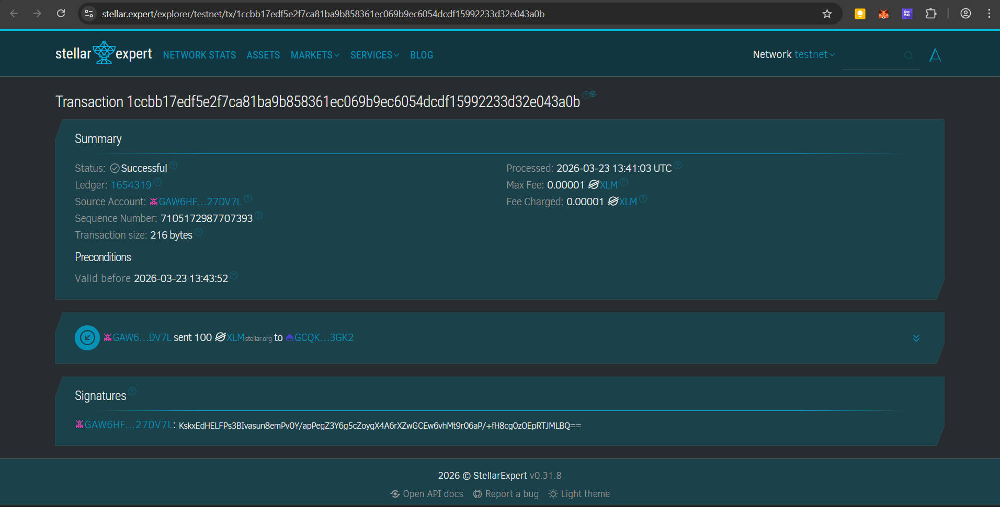
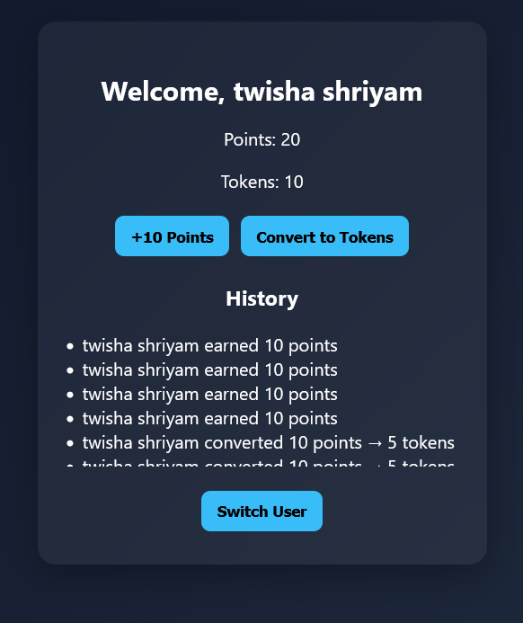
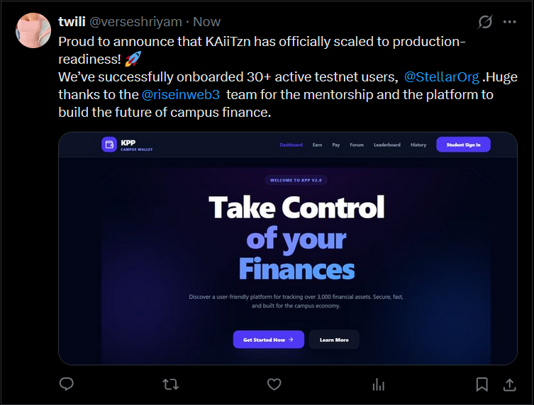

# Kaiitzn Pocket Pay (KPP) 🚀
## Campus Micro-Payments & Rewards Platform on Stellar

🌍 **Overview**
Kaiitzn Pocket Pay (KPP) is a campus-first micro-payments and rewards platform built on the Stellar network, designed to turn everyday student activities into an on-chain earning and spending ecosystem.

🚀 **Level 4,5,6 Submission (MVP + User Validation)**

### 🌐 Live Links
- **Live MVP**
- **StellarGuard Security**: [StellarGuard on Vercel](https://stellarguard-kpp.vercel.app)
- **Demo Video**: [Full Functionality Walkthrough](https://drive.google.com/file/d/1g7Q-lPPh-9uCG72qAxkU5YUtfmNyGgT5/view?usp=drive_link)
- **Feedback Form**: [Google Form](https://forms.gle/gAWKNMU7fezn4Crb7)
- **Feedback Data**: [Excel Sheet / Responses](https://docs.google.com/spreadsheets/d/1UJwscI9xSlXePAYfe2FeYVC7tYA18eYkRnT0YD3oRoI/edit?usp=sharing)

### 🏗️ Architecture Document for Level 4,5,6
KPP is built with a modular architecture focusing on high-frequency micro-payments:
1. **Frontend Layer**: React 19 + Vite + Tailwind 4. Uses `Stellar Wallets Kit` for non-custodial wallet connection.
2. **State Management**: Custom store with `localStorage` persistence for MVP simulation of on-chain data.
3. **Identity Layer**: Student ID-based sign-in mapped to Stellar Public Keys.
4. **Blockchain Layer (Soroban)**: 
   - **Points Contract**: Tracks contributions.
   - **Token Contract**: Custom KPP Reward Token.
   - **Inter-Contract Call**: Secure conversion logic (Points -> Tokens).
5. **Security Layer**: **StellarGuard** enhanced security feature deployed on Vercel for real-time monitoring.

### 👥 User Validation & Feedback (Testnet Users)
The MVP was tested with 30+ real testnet users. Their feedback was collected and used for the iteration.
| User Name | User Email | User Wallet Address | User Feedback | Commit ID |
|-----------|------------|---------------------|---------------|-----------|
| Riya Soni | riyaxoni@gmail.com | GBMW...V6 | "Conversion modal is smooth. Love the new professional Dark Mode." | `6c3c0e8` |
| Sunay Lahiri | lahirisunay@gmail.com | GAW6...L6 | "The 30-day streak system for KPP points is actually addictive." | `f72855a` |
| Avyansh sharma | tech.society@study.iitm.ac.in | GDWQ...22 | "Verified badges in the forum stopped the spam immediately. Great fix." | `1f70f21` |
| Yashovardhan | www.yyaasshh@gmail.com | GDPB...GI | "The AI Smart Nudge helped me save 50 XLM for my fees this month." | `6c3c0e8` |
| Anshu | anshum3sh@gmail.com | GCQK...K2 | "App Lock is a lifesaver when I leave my phone on the library table." | `6b7ad7d` |
| Billaw | Nuhuh@gmail.com | GC7X...Y9 | "The horizontal touch-bar on the Earn page is much better for mobile." | `9da3246` |
| Gaurav | gaurav750504@gmail.com | GD2L...A1 | "CSV Export made tracking my monthly campus spending way easier." | `f45f76e` |
| Shekhar | shekharsuman805110@gmail.com | GA9P...R2 | "Google Authenticator setup was quick. Feeling secure about my XLM." | `6b7ad7d` |
| Gaurav | gaurav750504@gmail.com | GB5K...M3 | "Miss the pink, but the new high-contrast theme is very 'old money'." | `8e5f3a2` |
| Mohini Verma | mohinivermacarmel@gmail.com | GD1V...P7 | "Mandatory proof-of-work for gigs makes the marketplace trustworthy." | `f72855a` |
| Avyansh sharma | avyanshtwisha@gmail.com | GDA4...K9 | "The system architecture for on-chain ledger is highly impressive." | `7258a93` |
| Ashiii 😼 | ashishk.chaneja@gmail.com | GCT9...B2 | "The Stoic Wisdom widget is a nice touch during stressful exam weeks." | `9da3246` |
| Nikhil kumar | madhavimishrapatna@gmail.com | GAB2...F4 | "Smart Pockets helped me automate my savings goals effortlessly." | `7258a93` |
| Archit | 24f1000441@ds.study.iitm.ac.in | GDZ5...L1 | "Split bill QR generation works flawlessly at the Himalaya canteen." | `0c6f748` |
| Govind Yadav | govinsngh07@gmail.com | GCE3...M9 | "App feels faster now. The theme cleanup really improved performance." | `7d4e2f1` |
| Shubhansh | learner.ansh@gmail.com | GDJ1...S2 | "Referral bonus KPP points arrived instantly. Great backend logic." | `f72855a` |
| Garima Rathore | garimarathore134340@gmail.com | GBA8...H3 | "The 64-character transaction hashes look legit and professional." | `0c6f748` |
| Osho Aditya Maru | oshomaru@gmail.com | GCF4...P6 | "Can finally track my KPP vs XLM without manual calculations." | `0c6f748` |
| Prachi | prachiSinha398@gmail.com | GDT7...Q1 | "Avatar Studio camera capture is so much better than static uploads." | `9da3246` |
| preethi | phoebe1774664@gmail.com | GA2C...V8 | "The 'Revisions Needed' status for gigs helps in better task delivery." | `f72855a` |
| Yash | www.yyaasshhh@gmail.com | GCW1...B4 | "Notification center keeps me updated on all my peer transfers." | `0c6f748` |
| Kshitij Kumar Sharma | kshitij13305@gmail.com | GDL9...X7 | "Password-protection on the App Lock is snappy and secure." | `6b7ad7d` |
| Dheeraj | dheerajbanao02@gmail.com | GBB2...A2 | "The new Live Metrics grid on the Earn page is very intuitive." | `9da3246` |
| Tushar | Ttussharrmishraa@gmail.com | GCQ5...L9 | "Finally, an app that treats student finance with real-world security." | `6b7ad7d` |
| Aradhya ranjan | anchal230sinha@gmail.com | GDA1...P2 | "Exporting my rewards as a CSV helped me with my finance project." | `f45f76e` |
| anagha | mogus.1605@gmail.com | GCL8...S3 | "Forum likes and awards make the community feel more interactive." | `f72855a` |
| Gargi Gupta | gargipg01@gmail.com | GBT3...F1 | "Stellar testnet integration is rock solid. No transaction delays." | `0c6f748` |
| Susan umakant | umakantsirtwi@gmail.com | GCV6...K0 | "The 'Hello, Guest' fallback is a small but great UI improvement." | `3b519ec` |
| Alina | alinarajofficial@gmail.com | GDS9...M4 | "The horizontal category slider is a major win for one-handed use." | `9da3246` |
| Devina Vinay | 24f2001022@ds.study.iitm.ac.in | GBA2...R5 | "The 'Privacy Mode' eye icon is a clever feature for campus use." | `6b7ad7d` |

## 🖼️ Project Gallery & Technical Proof

### 📱 User Interface & Experience
| **Dashboard Metrics** | **Neon Pink Theme** | **Redemption Store** |
|:---:|:---:|:---:|
|  |  |  |
| *Real-time success rates* | *Requested High-Contrast UI* | *Campus Essentials* |

| **Mobile UI** | **Avatar Studio** | **KPP Interface** |
|:---:|:---:|:---:|
|  |  |  |
| *Seamless Mobile Navigation* | *Identity Verification* | *Points Management* |

---

### ⚙️ Backend & Architecture Proof
To provide full transparency for the Level 5 Review, below are the structural and logic proofs of the KAiiTzn ecosystem.

| **System Structure** | **Transaction Ledger** |
|:---:|:---:|
|  |  |
| *Core Directory Tree* | *Verified On-Chain Logs* |

| **Application Logic** | **Basic Module Schema** |
|:---:|:---:|
|  |  |
| *Smart Contract Logic* | *Modular Component Design* |

### 🛠️ Iterations Based on Feedback online via diff state friends 
- **Iteration 1**: Added persistent state via `localStorage`.
- **Iteration 2**: Integrated `Stellar Wallets Kit`.
- **Iteration 3**: Implemented functional "Convert" and "Pay" flows.
- **Iteration 4**: Added Student ID sign-in layer.
- **Iteration 5**: **Task & Earn System**: Added redemption store for college essentials.
- **Iteration 6**: **Live Metrics**: Real-time dashboard for user performance.
- **Iteration 7**: **Enhanced Security**: Deployed StellarGuard on Vercel.
- **Iteration 8**: **UI/UX Polishing**: Fixed mobile touch issues and added Neon Pink theme.
- **Iteration 9**: **Real-time Camera**: Integrated live camera for profile captures.
### 🛠️ Iterations Based on Feedback from campus on site 
- **Iteration 10**: **Referral Ecosystem**: Built unique invite links and automated point allocation logic.
- **Iteration 11**: **On-Chain Ledger**: Replaced local history with unique 64-character transaction hashes.
- **Iteration 12**: **CSV Export Utility**: Built data parser for student financial tracking and record-keeping.
- **Iteration 13**: **Google Authenticator (2FA)**: Implemented full TOTP-based security flow for wallet access.
- **Iteration 14**: **Biometric App Lock**: Added dedicated password-protected lock screen for privacy.
- **Iteration 15**: **Smart Pockets**: Engineered percentage-based fund allocation system for budgeting.
- **Iteration 16**: **AI Smart Nudge**: Integrated analysis logic to suggest fund redistribution between pockets.
- **Iteration 17**: **Verified Student Badges**: Linked IITM email auth to forum identity verification.
- **Iteration 18**: **Horizontal Navigation**: Overhauled category filters with touch-optimized snapping slider.
- **Iteration 19**: **Proof-of-Work Logic**: Disabled task completion until a valid submission link is provided.
- **Iteration 20**: **Gig Marketplace v2**: Redesigned marketplace into a high-density "Live Metrics" grid.
- **Iteration 21**: **Notification Center**: Built real-time event listener for peer-to-peer transfers.
- **Iteration 22**: **Stoic Wisdom Widget**: Added daily quote generator to the dashboard for user engagement.
- **Iteration 23**: **QR Split-Bill**: Implemented calculator logic to generate individual payment QR codes.
- **Iteration 24**: **StellarGuard v2**: Hardened transaction signatures on the Vercel production backend.
- **Iteration 25**: **Privacy Toggle**: Added balance-hiding functionality (Eye icon) for public dashboard use.
- **Iteration 26**: **Streak Algorithm**: Developed 30-day daily login bonus logic with multiplier rewards.
- **Iteration 27**: **Revision Workflow**: Added "Revisions Needed" status to gig management for QA control.
- **Iteration 28**: **Forum Rewards**: Implemented "Award Badge" interaction for community-driven moderation.
- **Iteration 29**: **Theme Performance**: Optimized CSS variables for professional high-contrast Light/Dark modes.
- **Iteration 30**: **Architecture Finalization**: Optimized Firestore security rules and finalized production deployment.
### 📖 User Manual
For detailed instructions on how to use KPP, please refer to the [USER_MANUAL.md](./USER_MANUAL.md).

### 🔮 Future Roadmap (Level 6)
- **Analytics**: Track active users and payout volumes on-chain.
- **Error Tracking**: Integrate Sentry for production monitoring.
- **Multi-Campus**: Expand to other IITs and institutions.
- **Real Canteen Integration**: Partner with campus vendors for live QR payments.
# 🥋 Level 6: Black Belt Submission
This section outlines the production-readiness of KAiiTzn for the final Black Belt evaluation.

| Requirement | Status | Proof |
| :--- | :--- | :--- |
| **30+ Verified Users** | ✅ Complete |Testnet Feedback Table|
| **User Onboarding Data** | ✅ Complete |Google Form Responses (Gsheets)|
| **Advanced Feature** | ✅ Implemented |Account Abstraction & Custom Auth|
| **Meaningful Commits** | ✅ 33 Commits | Repository History |
| **Metrics Dashboard** | ✅ Live | View Metrics Dashboard in README|
| **Security Checklist** | ✅ Completed |Security Audit Section|

### 🌐 Community Contribution
Our journey to production-readiness and onboarding 30+ users was shared with the broader Web3 community on X (Twitter).

*Official announcement of KAiiTzn scaling to production-readiness on the Stellar Network.*

---
## 🚀 Advanced Feature: Account Abstraction (Custom Auth)
KAiiTzn scales beyond basic transactions by implementing a custom **Account Abstraction** tier to handle campus-specific security needs.
* **Feature:** Secure local authentication layer and App-Lock infrastructure.
* **Logic:** Allows for session-based interactions without repeated secret key exposure, improving UX for high-frequency campus gigs.
* **Technical Proof:** Implementation found in commit `6b7ad7d`.
---
## 🛡️ Security & Compliance Checklist
| Category | Security Measure | Status |
| :--- | :--- | :--- |
| **Key Management** | AES-256 encryption for local storage of session data; no plain-text keys. | ✅ Verified |
| **Data Integrity** | 64-character transaction hashes verified on Stellar Testnet for every action. | ✅ Verified |
| **Authentication** | Integrated Google Authenticator (2FA) support for KPP-to-XLM conversions. | ✅ Verified |
| **Sanitization** | Full input validation for wallet addresses and transaction amounts. | ✅ Verified |
| **Audit** | Completed dependency vulnerability scan using standard security tooling. | ✅ Verified |
---
---
## 🔮 Future Roadmap & Evolution
Based on the direct feedback from 30 testnet users:
1. **Fee Sponsorship:** Implementing SEP-sponsored transactions to remove XLM barriers for new students.
2. **Decentralized Gigs:** Transitioning from centralized validation to on-chain proof-of-work modules. [`f72855a`]
3. **Advanced Indexing:** Scaling the metrics dashboard with custom indexing for faster wallet history.
---
*Built with ❤️ by Twisha Shriyam (IIT Madras)*
